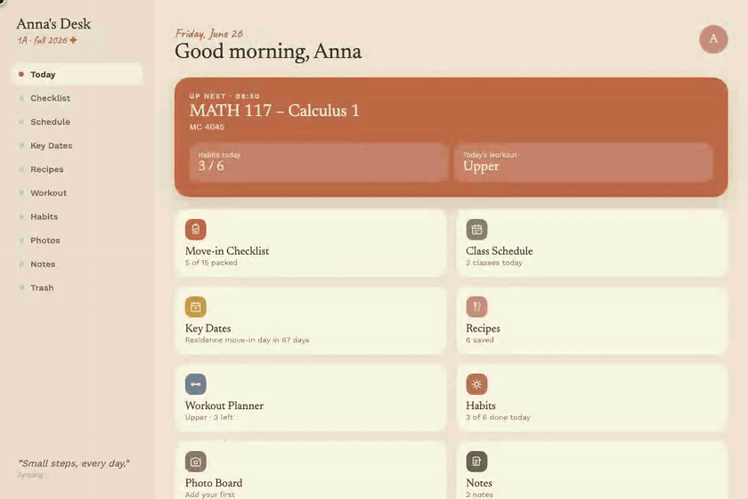
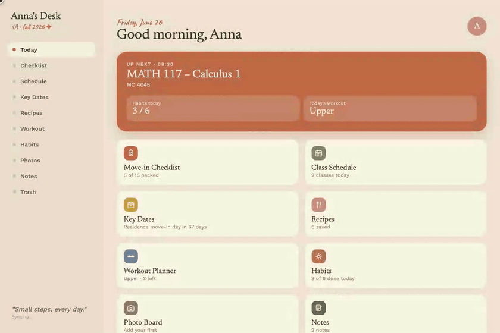

<div align="center">

# Anna's Desk

**A personal planning PWA for university life**

*Track classes, habits, workouts, recipes, notes, and key dates — all in one place.*


</div>

---


---

## Features

Anna's Desk is organized into ten sections, each designed to reduce friction around a specific part of student life.

---

### Today's Dashboard

A personalized landing page that greets you by name, surfaces your next class, shows today's habit progress and workout status, and links out to every section via a clean tile grid.


---

### Move-in Checklist

A categorized packing list with a live progress bar. Items are grouped by category (clothing, tech, kitchen, etc.) and each can be checked off, added, or deleted. Deleted items go to Trash for recovery.


---

### Class Schedule

A full weekly view of your timetable with color-coded entries showing class name, time range, and room. New classes can be added at any time with day, time, and location fields.


---

### Key Dates

Important dates with live countdown badges. Urgent dates (within 3 days) show in terracotta, upcoming dates in gold, and past dates in muted grey. New dates can be added from the top form.



---

### Recipes

A two-tab collection of dorm-friendly Food and Drink recipes. Each recipe card shows prep time and ingredient count. Tapping one opens a full detail view with an ingredients list and numbered steps.


---

### Workout Planner

A 7-day split with per-day exercise lists. Each exercise tracks sets, reps, current weight, and previous weight (shown as a comparison chip). Check off exercises as you complete them and tap any weight chip to update it inline.


---

### Habits

Daily habits with streaks and a progress bar. Tap a circle to mark it done. The streak counter increments automatically. Add new habits from the input at the bottom.


---

### Photo Board

A masonry photo grid for saving campus moments, dorm setups, or anything worth remembering. Photos can have captions, and are stored locally or synced to the cloud.


---

### Notes

A rich-text note editor with a formatting toolbar: **bold**, *italic*, underline, strikethrough, bullet and numbered lists, and five highlight colors. Keyboard shortcuts (Cmd+B, Cmd+I, Cmd+U) work as expected. Notes are auto-saved as you type.


---

### Trash

Soft-deleted items from Notes, Recipes, Checklist, Key Dates, and Habits land here with a 7-day expiry countdown. Items can be restored to their original section or permanently deleted.



---

## Tech Stack

| Layer | Technology |
|---|---|
| UI framework | React 18 (via CDN, no build step) |
| Component runtime | dc-runtime (custom JSX-to-React compiler) |
| Database | Supabase (PostgreSQL) |
| Offline persistence | localStorage |
| Service worker | Vanilla JS, for PWA caching |
| Fonts | Newsreader, Work Sans, Caveat (Google Fonts) |
| Hosting | GitHub Pages |

No Node.js, no bundler, no build pipeline. The entire app is a single `index.html` file plus a compiled `support.js` runtime.

---

## Running Locally

```bash
git clone https://github.com/dnsva/anna-s-desk.git
cd anna-s-desk
python3 -m http.server 3000
```

Then open [http://localhost:3000](http://localhost:3000).

The app works fully offline using localStorage. Cloud sync via Supabase is optional and requires the project's Supabase credentials.

---

## Data and Sync

All data is stored in `localStorage` under the key `collegeApp_v4`. On load, the app attempts to sync from Supabase and will merge cloud data if present. Changes are pushed to Supabase automatically. If the network is unavailable, the app continues working offline and displays a sync status indicator.

Soft-deleted items are retained in Trash for 7 days before being purged automatically.

---

<div align="center">

*Small steps, every day.*

</div>
